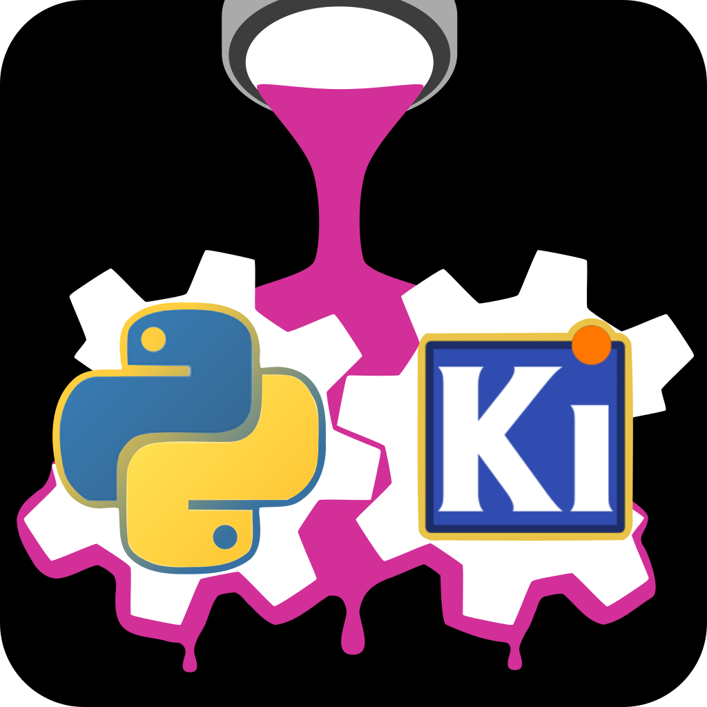

# kigadgets
### a.k.a. kicad-python: atait fork
Development of a stable Python scripting API for KiCad based on Piers Titus van der Torren work and comunity feedback.

[v4.99 Documentation](https://kigadgets.readthedocs.io/en/4.99-refactor)



## Description
KiCAD and pcbnew expose a python API that allows plugins and other procedural processing of PCB layouts. There are limitations of using this API directly: [its documentation](https://docs.kicad.org/doxygen-python/namespacepcbnew.html) is empty (v7 does not exist yet); it is a clunky SWIG/C-style API with custom datatypes for things like lists; its API changes for every KiCAD version; and it exposes too much functionality on equal footing.

Even if the perfect built-in KiCAD python API came tomorrow, new plugins written on that API would not work in v4-v7, and old plugins would no longer work. Plugins written using `kigadgets` instead are backwards compatible, forwards compatible, and easier to understand for KiCAD newcomers.

This package is a pythonic wrapper around the various `pcbnew` APIs. It implements patterns such as objects, properties, and iterables. It performs more intuitive unit and layer handling. It only exposes functionality most relevant to editing boards, the idea being that native functionality can always be accessed through the wrapped objects if needed.

This package has been fully tested with KiCAD 5, 6, 7 and partially tested with 7.99.

> [!CAUTION]
> The atait fork is undergoing a refactor that will result in new package imports.
> Instances of `from kicad.pcbnew.board import Board` must be replaced by `from kigadgets.board import Board` by version 0.5.0
>
> You are reading version 4.99

### An excerpt
A simple pythonic script might look like this
```python
print([track.layer for track in pcb.tracks])
print([track.width for track in pcb.tracks if track.is_selected])
```
which produces
```
[F.Cu, B.Cu, B.Cu]
[0.8, 0.6]
```
This simple interface is not possible with the C++ SWIG API. The python wrapper is handling things like calling the (sometimes hard to find) function names, sanitizing datatypes, looking up layers, and enabling the list comprehension.
Don't be fooled though - `track` and `board` contain no state. They use properties to give an intuition of state, but they are dynamically interacting with the underlying C++ `PCB_TRACK` and `BOARD`. You can always access the low-level objects using `track.native_obj`.

<!-- ## Installation via package manager
**IN PROGRESS**

v6+ only

1. Open kicad menu Tools > Plugin and Content Manager.
2. Scroll down to `kigadgets`
3. Double click. Apply transaction.
4. You are done
 -->

## Installation via PyPI (auto link)
```bash
pip install kigadgets
python -m kigadgets
```

> **Mac users:** There is an extra step. The above command will walk you through it. Read more about python on Mac [here](./macos_workaround).

Try it out! Quit and reopen pcbnew application. Open its terminal, then run
```python
pcb.add_circle((100, 100), 20, 'F.Silkscreen'); pcbnew.Refresh()
```

The `python -m kigadgets` command links paths needed for headless scripts to find `pcbnew` and for GUI plugins to find python packages external to KiCad, including `kigadgets`. For more detail on what the linker is doing, why, and advanced options, see [here](../design/linker_underthehood).

## Snippet examples
These snippets are run in the GUI terminal. They are common automations that aren't worth making dedicated action plugins. There is no preceding context; the linking step above provides `pcb` to the terminal. These all should work in pcbnew 5, 6, or 7 on Mac, Windows, or Linux.

### Hide silkscreen labels of selected footprints
```python
for fp in pcb.footprints:
    if fp.is_selected:
        fp.reference_label.visible = False
pcbnew.Refresh()
```


### Move all silk labels to fab layers
Instead, we can keep them on Fab layers so we can still see them while designing the PCB.
```python
for m in pcb.footprints:
    ref = m.reference_label.layer.split('.')  # Gives tuple like ('B', 'Silkscreen')
    if len(ref) > 1 and ref[1].startswith('Silk'):
        ref.layer = ref[0] + '.Fab'
pcbnew.Refresh()
```

### Select similar vias
This snippet assumes you have selected one via
```python
og_via = pcb.selected_items[0]
for via2 in pcb.vias:
    if via2.diameter != og_via.diameter: continue
    if via2.drill != og_via.drill: continue
    via2.select()
og_via.select(False)
pcbnew.Refresh()
```
See `via.py` for additional functionality related to micro and blind vias.

### Change all drill diameters
Because planning ahead doesn't always work
```python
for v in pcb.vias:
    if v.drill > 0.4 and v.drill < 0.6:
        v.drill = 0.5
pcbnew.Refresh()
```

### Put silkscreen over tracks
Not sure why to do this besides a nice look.
```python
for t in pcb.tracks:
    new_width = t.width * 1.1
    pcb.add_line(t.start, t.end, 'F.SilkS' if t.layer == 'F.Cu' else 'B.SilkS', new_width)
pcbnew.Refresh()
```

### Select everything schematically connected to this footprint
```python
fp = pcb.selected_items[0]
nets = {pad.net_name for pad in fp.pads}
nets -= {'GND', '+5V'}  # because these are connected to everything
for mod in pcb.footprints:
    if any(pad.net_name in nets for pad in mod.pads):
        mod.select()
```

### Import user library for GUI/CLI
Suppose you wrote a file located in $KICAD_SCRIPTING_DIR/my_lib.py
```python
# ~/.config/kicad/scripting/my_lib.py (Linux)
# ~/Library/Preferences/kicad/scripting/my_lib.py (MacOS)
from kigadgets.board import Board

def do_something(pcb):
    ...

if __name__ == '__main__':
    pcb = Board.load(sys.argv[1])
    do_something(pcb)
    newname = os.path.splitext(pcb.filename)[0] + '-proc.kicad_pcb'  # Prevent overwrite of source file
    pcb.save(newname)
```

(API entry point) You can run it in the pcbnew.app terminal *or* any external python interpreter like this
```python
from my_lib import do_something
do_something(pcb)
pcbnew.Refresh()
```
or (CLI entry point) from the command line like
```bash
python my_lib.py some_file.kicad_pcb
```
or (GUI entry point) `my_lib` can be imported by any other action plugins in the GUI.

### Keep track of live editor state
```python
from kigadgets.drawing import Rectangle
my_rect = Rectangle((0,0), (60, 40))
pcb.add(my_rect)
pcbnew.Refresh()
print(my_rect.x, my_rect.contains((1,1)))  # 30 True
# Go move the new rectangle in the editor
print(my_rect.x, my_rect.contains((1,1)))  # 15.2 False
```
`kigadgets` stays synchronized with the state of the underlying native objects even when they are modified elsewhere because it is wrapping the C++ state rather than holding a Python state.

### Procedural layout
Suppose you want to test various track width resistances.
```python
y = 0
length = 50
widths = [.12, .24, .48, .96]
r_contact = 5
for w in widths:
    pcb.add_track([(0, y), (length, y)], 'F.Cu', width=w)
    for lay in ['F.Cu', 'F.Mask']:
        for x in [0, length]:
            pcb.add_circle((x, y), r_contact / 2, lay, r_contact)
    pcb.add_text((length/2, y - 2), 'width = {:.2f}mm'.format(w), 'F.SilkS')
    y += 20
pcbnew.Refresh()
```
Go ahead and try this out in the pcbnew terminal, although this type of thing is better to stick in a user library (see above). The sky is the limit when it comes to procedural layout!

## Regression testing with `geohash`
KiCAD does not guarantee binary equivalence of .kicad_pcb files. kigadgets `Board` and `BoardItem`s implement `geohash`, which returns a hash value that depends on every item in the PCB. It provides a fast and well-defined way to detect whether two boards are logically equivalent or not.

Geometry hashing enables layout regression testing, git-diff, CI, and behavioral verification. We want to know that `kigadgets` is importing *and also* that it is producing correct behavior. Ok, "correct" is subjective. What we can do is ensure that behavior is logically unchanged when there are other changes: user code, kigadgets code, pcbnew.so, KiCAD version, operating system, kicad_pcb encoding, dependency updates, and so on.

```python
pcb1 = Board()
pcb1.add_track([(1, 1), (1, 2)])
pcb2 = Board()
pcb2.add_track([(1, 2), (1, 1)])
assert pcb1.geohash() == pcb2.geohash()  # Succeeds
```

Utilities specific to automated regression testing are provided by [`lytest`](https://github.com/atait/lytest). See kigadgets tests for examples.

Note, for security reasons, `geohash` uses a random seed that changes when python is invoked. It is not repeatable between interpreter sessions. That means:
- do not store the geohash value for reference; instead store the .kicad_pcb for reference. When loaded, it will get the seed corresponding to this session.
- `geohash` should not be used for autenthification checksums; instead use md5 on the file itself

> [!TIP]
> If you don't view yourself as a coder, you can become one! Have a look at the snippets above - do you understand what they are doing? If so, you can code.
> While you are [learning python syntax](https://docs.python.org/3/tutorial/index.html), you can just copy the examples above and modify to suit your needs.

## Related Projects
KiCAD has a rich landscape of user-developed tools, libraries, and plugins. It is worth understanding this landscape in order to use the right tool for the job, whether it turns out to be `kigadgets`, others, or multiple.
See discussion of the landscape in [the documentation](kigadgets.readthedocs.io/en/4.99-refactor/design/related_projects.html).

## KiCad 9.0 and IPC API
KiCad 9 will introduce a python API based on inter-process communication (IPC) between an external python executable and an open pcbnew application. There are pros/cons to the IPC approach vs. the child process approach used here. Here, an external process launches a new process that has the `pcbnew` module available. This allows for scripts that work the same within and outside GUI, concurrent/multiprocess scripting, python environment customization, processing over SSH, and so on. `kigadgets` attempts to provide a stable API to `pcbnew` SWIG.

Later versions of `kigadgets` might use the IPC API as a backend but will maintain its frontend API throughout the 8->9->10 transition.