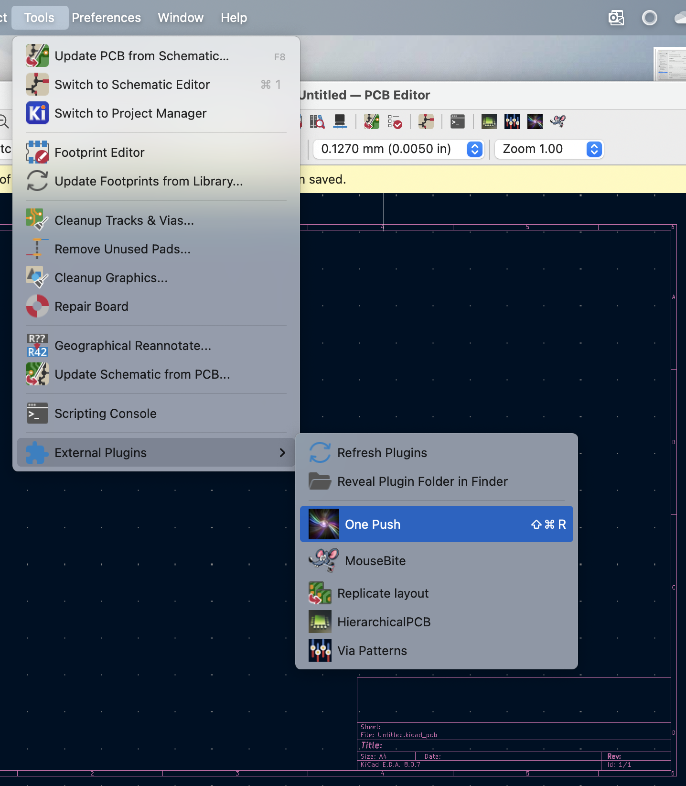

# Kigadgets OnePush action plugin
A simple example of an action plugin based on `kigadgets`. This example illustrates concepts of code interpretation and file reloading from the KiCad GUI using the `kireload` alias (version/platform independent). It is also useful in itself for script-assisted GUI layout design. Shown here, One Push is hotkeyed to Shift-Ctrl-R.


onepush_script.py is executed in the GUI environment when the action plugin button is pushed. Edit it yourself in any external editor, save the file, and behavioral changes will take effect immediately. No need to restart KiCad or reload the plugins from the menu.

action_onepush.py does the explicit re-importing to allow this real-time refresh. Do not edit this file.

## Usage
**GUI**: symlink this directory to your kicad scripting path, for example (Linux)

```bash
ln -s /the/full/path/to/examples/action_plugins/onepush ~/.config/kicad/9.0/scripting/plugins
```
reload action plugins (or restart pcbnew), then click the button.

KiCad does not have a way to hotkey action plugins. Mac users, you can hotkey the menu item through the OS. Go to System Settings > Keyboard > App Shortcuts > KiCad.app, and give it the exact name "One Push".


