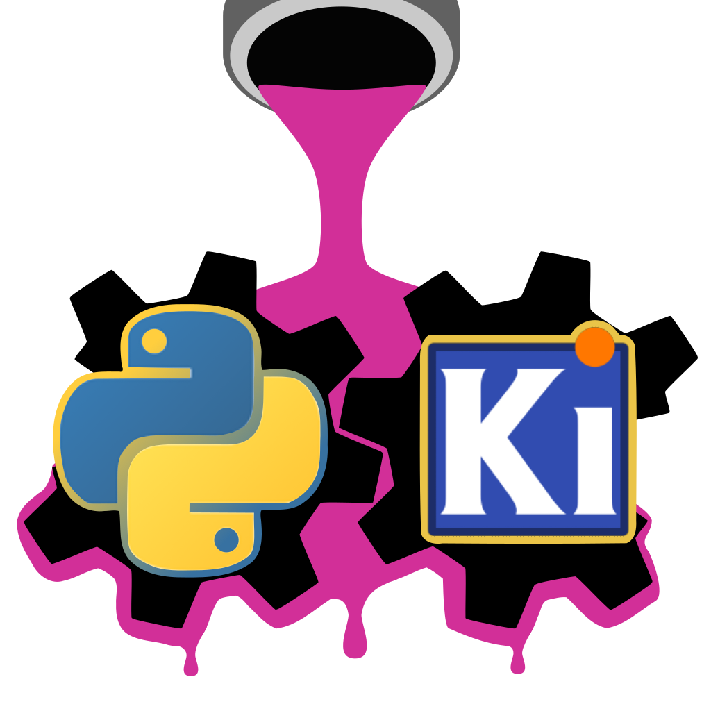

:py:mod:`kigadgets` Documentation
============================================

kigadgets makes KiCad and Python work better together.

From inside pcbnew you are able to recover the current Board object like this::

    from kigadgets.board import Board
    pcb = Board.from_editor()

From outside, you can load a board file like this::

    from kigadgets.board import Board
    pcb = Board.load('my_board.kicad_pcb')

Once you have a `Board`, all other operations behave exactly the same within the GUI or outside the GUI.::

    >>> print([track.layer for track in pcb.tracks])
    [F.Cu, B.Cu, B.Cu]
    >>> print([track.width for track in pcb.tracks if track.is_selected])
    [0.8, 0.6]

[Under construction]

.. toctree::
   :maxdepth: 1

   getting_started/index
   ap_devs/index
   design/index
   API/index

